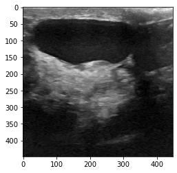
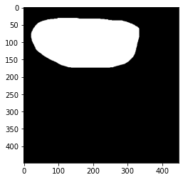
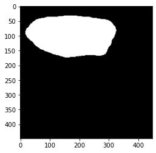

# UltraAnalysis, Ultrasound Image Segmentation & Classification

Author: Rayaq Siddiqui

## Purpose

Developing an ultrasound analysis API that can determine whether an individual has benign or malignant forms of cancer, or if they do not have any signs of cancer (i.e. normal). Given that an individual classifies as having some form of cancer growth in their ultrasound, there is a semantic segmentation model that can develop a mask to locate the benign cancer growth. This is going to made into an API since it will be easier to increase the usability of this model. For instance, if hospitals want to create quick masks around cancer growths in ultrasounds, they could simply use this model. Or for instance, if they are unsure if the there exists a benign, malignant or no cancer in the individual, they can use the classification models to ensure with 90%+ accuracy their analysis is correct

## Developing an API that can access 3 types of models
1. Semantic Segmentation Models
2. CNN Models
3. Sklearn Image Classification Models

## Certain Commands

The main.py command is meant for training the model on their respect datasets. 

`python main.py --model resnet50 --epochs 10 --verbose 1 --weights False`

The command above will train the resnet50 model with 10 epochs, without using previously trained weights

The api.py file is meant for creating the REST api for the model which allows other users to access their models

`uvicorn api:app --reload`

The command above initiates the server and will all GET/POST requests to come in.

## Examples of Semantic Segmentation

### Original Image 

### Predefined Mask

### Mask Generated of the Image given the original image as input

